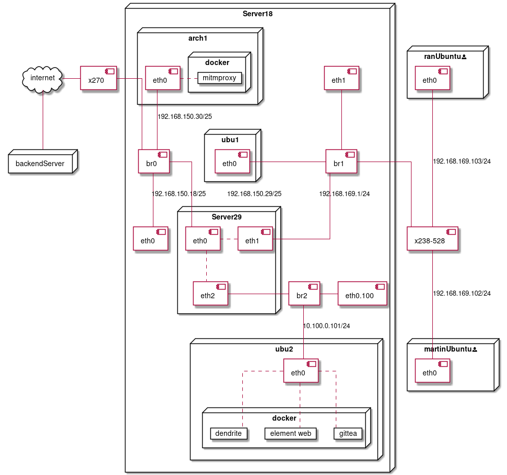

# Final Assignment
Written by Martin Maartensson

# The System
We have set up 3 images on Nebula, one "baseVM" (Server 18) and then 2 individual VM's, then we have created a whole environment of VM's inside the baseVM where we are managing the network from one of the internal VM's (Server 29). 



# The baseVM

First we install the Suse 13 distobution on Nebula and assign 2 nics 

## Post installation
After the installation its important to do a few configurations
### Disable default firewall
```
systemctl stop SuSefirewall2
systemctl disable SuSefirewall2
```
### Disable wicked
```
systemctl stop wicked
systemctl disable wicked
```
### Enable SSH
```
systemctl start sshd 
systemctl enable sshd
```
### Update the system
```
zypper update
zypper install zsh 	# for nicer shell
zypper install vim-data # for syntax in vim
```

### Create users and make them sudo

```
useradd {USERNAME} -m -s /bin/zsh -g wheel
passwd {USERNAME}
```

### Change hostname 

```
echo "server18" > etc/hostname
```

### Optimize reboot speed
1. Power off the host and remove the susecd from hosts
2. Go to edit `/boot/grub2/grub.cfg`
3. Find all the timeouts and set them to 0

```sh
set timeout=0
```

### Seccure SSH
Go to `/etc/ssh/sshd_config` and set these values
```
PermitRootLogin no
PasswordAuthentication no
```

# How to setup libvirt and bridging
We will setup libvirt and install a more modern version of suse so that we can do more stuff easier.

## Install libvirt
libvirt can be installed directly from zypper
```
zypper install libvirt
```

then to make installation easier we will install `virt-install` and accept all

```
zypper install virt-install
```

## get the new suse
We need to get the latest version of suse leap

[this is the link to download Suse Leap](https://download.opensuse.org/distribution/leap/15.2/iso/openSUSE-Leap-15.2-DVD-x86_64.iso)

we can save the file in the `/var/lib/libvirt/boot/` folder as `suse.iso`

then we will create the installation script in `/root/` and call it `virtinstall.sh` and give it execution rights `chmod +x virtinstall.sh`

```sh
#!/bin/bash

cd=suse
name=suse

virt-install \
--virt-type=kvm \
--name $name \
--ram 2048 \
--vcpus=2 \
--os-variant=generic \
--cdrom="/var/lib/libvirt/boot/$cd.iso" \
--network=bridge=br0,model=virtio \
--network=bridge=br1,model=virtio \
--network=bridge=br2,model=virtio \
--graphics vnc \
--disk path=/var/lib/libvirt/images/$name.qcow2,size=10,bus=virtio,format=qcow2
```

notice that we have defined the 3 bridges `br1`, `br2` and `br3`. We need to create them before we sucessfully can run `virtinstall.sh`

## network setup with bridges

The full script can also be found in the scripts folder

```sh
ip link add link eth0 name eth0.100 type vlan id 100
ip link add name br0 type bridge
ip link add name br1 type bridge
ip link add name br2 type bridge
ip link set up dev br0
ip link set up dev br1
ip link set up dev br2
ip link set dev eth0 master br0
ip link set dev eth1 master br1
ip link set dev eth0.100 master br2
ip link set up dev eth0
ip link set up dev eth1
ip link set up dev eth0.100
ip addr add dev br0 "192.168.150.18/24" brd +
ip route add default dev br0 via "192.168.150.1" scope global
echo 1 > /proc/sys/net/ipv4/ip_forward
```

Notice we are not assigning any ip address for either `eth0` or `eth2`, this is not necesarry because the `br0` is now representing `eth0` and we can access the host machine with the ip address for `br0`. `br1` is connected to `eth2` on the link layer and we can assign the ip address for that one later inside the VM. so lets create the VM.

## Create the VM (Server29)
We can now run the script `virtinstall.sh` that we created ealier.

```sh
./virtinstall.sh
```

Then we will wait a few second until the scripts is done.

We now need to connect to the vm via VNC so we will forward the port of the VM's vnc to our local workstation 

```sh
ssh -J \
	    passthru@omicron2.eitlab.diplom.dtu.dk \
	    martin@192.168.150.18 \
	    -L 5900:localhost:5900
```

The first VM's vnc port will be on 5900, if we make more then the port will increment.

When we are in vnc we just follow the installation through all the steps and restart the VM.

We now will open `virsh` on the main server18 and start the VM and enable autostart.

```sh
virsh start suse
virsh autostart suse
```

Then we can open vnc again and check the ip of the VM so that we can ssh into the vm and set it up, but lets first setup the other 3 VM's

## Create the sub VM's

the only difference here compared to the Suse Leap installation is that we download the image of ubuntu server 20.04 and the latest version of archlinux, then we change the name and the cd in the `virtinstall.sh` script and also we change the bridges they receive.

### Archlinux
arch linux will be in the same subnet as server18 and server29, so we give him `br0`

```sh
#!/bin/bash

cd=arch
name=arch

virt-install \
--virt-type=kvm \
--name $name \
--ram 2048 \
--vcpus=2 \
--os-variant=generic \
--cdrom="/var/lib/libvirt/boot/$cd.iso" \
--network=bridge=br0,model=virtio \
--graphics vnc \
--disk path=/var/lib/libvirt/images/$name.qcow2,size=10,bus=virtio,format=qcow2
```

### Ubu1
Ubu1 will be in the internal network so he will get `br1`

```sh
#!/bin/bash

cd=ubuntu
name=ubu1

virt-install \
--virt-type=kvm \
--name $name \
--ram 2048 \
--vcpus=2 \
--os-variant=generic \
--cdrom="/var/lib/libvirt/boot/$cd.iso" \
--network=bridge=br1,model=virtio \
--graphics vnc \
--disk path=/var/lib/libvirt/images/$name.qcow2,size=10,bus=virtio,format=qcow2
```

### Ubu1
Ubu2 will be in the VLAN so he will get `br3`

```sh
#!/bin/bash

cd=ubuntu
name=ubu2

virt-install \
--virt-type=kvm \
--name $name \
--ram 2048 \
--vcpus=2 \
--os-variant=generic \
--cdrom="/var/lib/libvirt/boot/$cd.iso" \
--network=bridge=br2,model=virtio \
--graphics vnc \
--disk path=/var/lib/libvirt/images/$name.qcow2,size=10,bus=virtio,format=qcow2
```

That was it then we just need to autostart them all with virsh

```sh
virsh autostart arch
virsh autostart ubu1
virsh autostart ubu2 
```

At this point there is no internet for any of the hosts and we will need to setup Server29 who has access to all the network interfaces, and is gonna be the main router of the system.

# The Main Router (Server29)

At this point we have not accessed server29 before and we need to do the same initial process as we did with server18 in the post installation. 

+ Disable default firewall
+ Disable wicked
+ Enable SSH
+ Update the system
+ install zsh
+ install ranger (visual terminal file manager)
+ Create users and make them sudo
+ Change hostname 
+ Optimize reboot speed
+ Seccure SSH
+ Enable ip forwarding

and because we are gonna use this one alot we will also install `oh-my-zsh` and setup the `~/.zshrc` with the follwing settings.

```
export ZSH="/root/.oh-my-zsh"
ZSH_THEME="kardan"
export UPDATE_ZSH_DAYS=30
plugins=(git extract)
source $ZSH/oh-my-zsh.sh
export EDITOR='vim'
alias r="ranger"
unsetopt beep
bindkey -v
zstyle :compinstall filename '/root/.zshrc'
autoload -Uz compinit
compinit
[ -f ~/.fzf.zsh ] && source ~/.fzf.zsh
```

This will make the terminal look, and feel very nice.
We will also be able to edit our commands with very good vim support.


and then we will setup the network script for the VM

## The network script
This network script is similar but still differen from the base server, since we will assign ip addresses for each interface.
Also we will setup DNS since it is not done automatically for us without wicked

```sh
#/root/bin/network.sh
...
echo "search omicron2.eitlab.diplom.dtu.dk" > /etc/resolv.conf
echo "nameserver 192.168.150.1" >> /etc/resolv.conf

ip addr add "192.168.150.29/25" dev eth0 brd +
ip addr add "10.100.0.1/24" dev eth1 brd +
ip addr add "192.168.169.1/24" dev eth2 brd +

ip link set dev eth0 up
ip link set dev eth1 up
ip link set dev eth2 up

ip route add default dev eth0 via 192.168.150.1 scope global
...
```

Then we need to add a service file for the script and enable it in systemd

_all the full scripts and service files for each VM is attached_

Now we can setup DHCP.

## The DHCP setup

So we have 2 interfaces now that we need to manage DHCP for.

+ br1 (eth1) - 192.168.169.0/24
+ br2 (eth2) - 10.100.0.0/24 :: VLAN


First lets install dhcp-server

```sh
zypper install dhcp-server
```

then we will edit the file `/ect/sysconfig/dhcpd` and add `eth1` and `eth2` as our dhcpd interfaces

```
DHCPD_INTERFACE="eth1 eth2"
```

then we will setup the subnet for the dhcp server in `/eth/dhcpd.conf`

```
ddns-update-style none;
default-lease-time 21600;
max-lease-time 43200;

subnet 192.168.169.0 netmask 255.255.255.0 {
        option routers 192.168.169.1;
        option domain-name "omicron2.eitlab.diplom.dtu.dk";
        option domain-name-servers 192.168.150.1;
        range 192.168.169.101 192.168.169.130;
}
subnet 10.100.0.0 netmask 255.255.255.0 {
        option routers 10.100.0.1;
        option domain-name "omicron2.eitlab.diplom.dtu.dk";
        option domain-name-servers 192.168.150.1;
        range 10.100.0.101 10.100.0.130;
}
```

then we need to start and enable dhdpd

```sh
systemctl enable dhcpd
systemctl start dhcpd
```

thats it now clients connected to the same interface as `eth1` will get an ip address from our dhcp server.

At this point it might be a good idea to restart server18 with everything inside it.

# VLAN and DMZ
On the host machine `server18` we have set up a vlan `eth0.100` which is controled by a bridge `br2`, the brigde is then passed into the router vm `server29`

`server29` is functioning as a firewall and DHCP server for the VLAN, 

in libvirt on `server18` we created another vm `ubu2` which only has one nic, which is assigned to the VLAN `eth0.100` through `br2` and is therfore assigned an ip address by `server29` in the range `10.100.0.101` to `10.100.0.130`

If we try to access the internet from `ubu2` we will not get any response since there is no route from the vlan to the internet. However we have a route to the host `server29` on the link layer and can access all its ip addesses `10.100.0.1`, `192.168.169.1` and `192.168.150.29`. This means we can connect to it via ssh.

So on `server29` we create a new user called `jumper` and then we go to our `sshd` config in `/etc/ssh/sshd_config` and add this to the bottom

```
Match User jumper
        AllowTcpForwarding yes
    	PasswordAuthentication no
        ForceCommand echo 'forward to backend'
        PermitOpen 130.225.170.70:22022
```


Now we want to login to the server on `130.225.170.70` and create a similar user as `jumper` and set similar rules in `/etc/ssh/sshd_config`

so first we add the user:
```
useradd -m linux
```

then we add the config to the end of `sshd_config`:
```
Match user linux
    ForceCommand echo 'hello fello'
    PasswordAuthentication no
    AllowTcpForwarding yes
    PermitOpen localhost:443
```
We will allow localhost on port 443 since this is also the port we expose from that server to the internet, but the idea here is just to restrict access to anything on the server, so that it can only be used for remote forwarding.

Now we want to automate the action of forwarding so we need to authenticate ourselves with an ssh key instead of writing password

Now we create a ssh key pair for the user on `ubu2` and put them in `etc/server/ssh_keys/`

```
ssh-keygen -t rsa -b 2048
```

and manually copy the key to the `jumper` accout on `server29` and the `linux` account on `130.225.170.70`. (we cannot copy it with `ssh-copy-id` because of the `ForceCommand` we made in the `sshd_config`'s)

Then we will edit ssh client config file on `ubu2` in `/etc/ssh/ssh_config` and add the following content to the end:

```
Host parent
	User jumper
	Hostname 10.100.0.1
	IdentityFile /etc/server/ssh_keys/id_rsa

Host backend
	User linux
	Hostname 130.225.170.70
	port 22022
	ProxyJump parent
	RemoteForward 8080 localhost:8080
	RemoteForward 8081 localhost:8081
	RemoteForward 8082 localhost:8082
	RemoteForward 8083 localhost:8083
	RemoteForward 8084 localhost:8084
	IdentityFile /etc/server/ssh_keys/id_rsa
```

This means that we have an alias `parent` which is linking to `server29` and and alias backend which is using `parent` as a proxy and forwarding a range of ports from `ubu2` to the host on `130.225.170.70`

to forwad the ports we simply need to write

```
ssh -N backend
```

`-N` means we will not ask to get a shell

So now we can add this to a service file so we can have persistent port forwarding.

## forwarding service

Lets create a file `/etc/systemd/system/server.service` with the following content:

```
[Unit]
Description=Ssh forwarding service
After=network.target

[Service]
Type=simple
ExecStart=/usr/bin/ssh -N backend
RestartSec=5
Restart=always

[Install]
WantedBy=multi-user.target
```

then we can restart `systemd` 

```
systemctl daemon-reload
```

and because we are using known hosts to avoid dns spoofing attacks, then we need to login as root one time and write `yes` to accept the host. Or else the `systemd` service will never start forwading ports.

as root
```
ssh backend
```

and then enable and start the service

```
systemctl enable server
systemctl start server
```

we can now check if it works by either checking journalctl for a big pinguin

```
journalctl -xeu server
```

it should look like this
```
May 13 10:06:40 ubu2 ssh[1444]: *******************************************
May 13 10:06:40 ubu2 ssh[1444]: WELCOME TO Group4 BACKEND SERVER
May 13 10:06:40 ubu2 ssh[1444]: *******************************************
May 13 10:06:40 ubu2 ssh[1444]:          _nnnn_
May 13 10:06:40 ubu2 ssh[1444]:         dGGGGMMb     ,"""""""""""""".
May 13 10:06:40 ubu2 ssh[1444]:        @p~qp~~qMb    | Linux Rules! |
May 13 10:06:40 ubu2 ssh[1444]:        M|@||@) M|   _;..............'
May 13 10:06:40 ubu2 ssh[1444]:        @,----.JM| -'
May 13 10:06:40 ubu2 ssh[1444]:       JS^\__/  qKL
May 13 10:06:40 ubu2 ssh[1444]:      dZP        qKRb
May 13 10:06:40 ubu2 ssh[1444]:     dZP          qKKb
May 13 10:06:40 ubu2 ssh[1444]:    fZP            SMMb
May 13 10:06:40 ubu2 ssh[1444]:    HZM            MMMM
May 13 10:06:40 ubu2 ssh[1444]:    FqM            MMMM
May 13 10:06:40 ubu2 ssh[1444]:  __| ".        |\dS"qML
May 13 10:06:40 ubu2 ssh[1444]:  |    `.       | `' \Zq
May 13 10:06:40 ubu2 ssh[1444]: _)      \.___.,|     .'
May 13 10:06:40 ubu2 ssh[1444]: \____   )MMMMMM|   .'
May 13 10:06:40 ubu2 ssh[1444]:      `-'       `--' h__
```

or we can also login to the backend server and check if the ports are open with
```
ssh -tlpn
```

At this point we can set up a reverse proxy like NGINX on the remote server to share our services from the docker containers we will setup on the ubu2 before the examn on the 28th.

this will be:
* Dendrite beta (a matrix server written in go)
* A front end for the matrix server
* SQLlite

Ok, now lets make som security:

# Security

We have looked at many different options of security and we have even created our own small tools in Go, to help us with managing logging and sending mails.

We were looking at alot and we ended up using these:

+ MITMProxy (a simple http and https proxy with a web interface and python API)
+ Tripwire (a Host intrusion detection system) 
+ Our own logwatcher which is listening to journalctl, and sending mails in a user defined interval.
+ Firewall with `iptables`

## MITMProxy
We started by using squid but we got some problems when we needed to work with https, so we started looking at MITMProxy since we could get a direct binary and execute it on the old Suse 13, then we could set up simple scripts in python so modify the content of a request.
[a collection of scripts for MITMProxy](https://github.com/KevCui/mitm-scripts)

```python
#~/script.py
from mitmproxy import http


def request(flow: http.HTTPFlow) -> None:
    if flow.request.url.contains("google"):
        flow.response = http.HTTPResponse.make(
            200,
            b"Hello from group 10.1\n", 
            {"Content-Type": "text/html"}
        )
```

then we can just start our proxy like this

```
mitmweb -s ~/script.py
```

MITMProxy is also providing their own docker image so we wanted to make our arch machine a docker station for proxying.

### MITMProxy Docker in the Arch VM
First we update the machine, install docker, start and enable it.

```sh
sudo pacman -Syu
sudo pacman -S docker
sudo systemctl start docker
sudo systemctl enable docker
```

Then we created a docker file so that we can get our script inside the container as well

```docker
FROM mitmproxy/mitmproxy:latest

COPY ./conf.py .

EXPOSE 8081
EXPOSE 8080

CMD ["mitmweb", "--mode", "transparent", "--web-host", "0.0.0.0", "-s", "conf.py", "--showhost"]
```

Then we build the image 

```sh
sudo docker build -t mitm .
```

Finally we start the server.

```sh
docker run --rm -it -v ~/.mitmproxy:/home/mitmproxy/.mitmproxy -p 8080:8080 -p 8081:8081 mitm
```

We share the location `.mitmproxy` since our autogenerated ca-certificates are saved here, and then we can reuse them next time we start the server. (we could also create our own very easily but now we just use the autogenerated ones)

On the client machines we can then take the `pem` certificate and copy them into `/usr/local/share/ca-certificates/mitmproxy.crt` and then we need to run
```sh
update-ca-certificates
```

Then we can use the proxy but it has to be transparent since the proxy is set to transparent mode and we will get into how we do that when we talk about the Firewall.

## Firewall (iptables)

On the router machine (server29) we will set up a firewall script that we will launch on every boot.

it looks like this
```sh
...
# SET POLICIES
iptables -P INPUT DROP
iptables -P OUTPUT DROP
iptables -P FORWARD DROP
# ALLOW ALL TRAFIC ON LOCALHOST INTERFACE
iptables -A INPUT -i lo -j ACCEPT
# ALLOW ALL TRAFIC ON DMZ INTERFACE
iptables -A INPUT -i eth1 -j ACCEPT
iptables -A OUTPUT -o eth1 -j ACCEPT
iptables -A FORWARD -i eth1 -j ACCEPT
# SET INPUT AND OUTUT STATE ORIENTED ACCEPT FOR INPUT OUTPUT AND FORWARD
iptables -A INPUT -m conntrack --ctstate ESTABLISHED,RELATED -j ACCEPT
iptables -A OUTPUT -m conntrack --ctstate ESTABLISHED,RELATED -j ACCEPT
iptables -A FORWARD -i eth0 -o eth2 -m conntrack --ctstate ESTABLISHED,RELATED -j ACCEPT
iptables -A FORWARD -i eth2 -o eth0 -m conntrack --ctstate ESTABLISHED,RELATED -j ACCEPT
# ALLOW HTTP AND HTTPS
iptables -A OUTPUT -p tcp --dport 80 -j ACCEPT
iptables -A OUTPUT -p tcp --dport 443 -j ACCEPT
#Allow Ping
iptables -A INPUT -p icmp -m icmp --icmp-type 8 -j ACCEPT
# ALLOW DNS
iptables -A OUTPUT -p udp --sport 53 -j ACCEPT
iptables -A OUTPUT -p udp --dport 53 -j ACCEPT
# ALLOW SSH
iptables -A INPUT -p tcp --dport 22 -j ACCEPT
iptables -A OUTPUT -p tcp --dport 22 -j ACCEPT
# https://www.digitalocean.com/community/tutorials/how-to-forward-ports-through-a-linux-gateway-with-iptables
iptables -A FORWARD -i eth0 -o eth2 -p tcp --dport 22 -j ACCEPT
iptables -A FORWARD -i eth2 -o eth0 -p tcp --dport 80 -j ACCEPT
iptables -A FORWARD -i eth2 -o eth0 -p tcp --dport 443 -j ACCEPT
iptables -A FORWARD -i eth2 -o eth0 -p udp --dport 53 -j ACCEPT
# PROXY HTTP AND HTTPS THROUGH SQUID ()
# https://www.youtube.com/watch?v=mCmn3bb26xc
iptables -A FORWARD -i eth2 -o eth0 -p tcp --dport 8080 -j ACCEPT
iptables -t nat -A PREROUTING -i eth2 -p tcp --dport 80 -j DNAT --to 192.168.150.30:8080
iptables -t nat -A PREROUTING -i eth0 -p tcp --dport 80 -j REDIRECT --to-port 8080
iptables -t nat -A PREROUTING -i eth2 -p tcp --dport 443 -j DNAT --to 192.168.150.30:8080
iptables -t nat -A PREROUTING -i eth0 -p tcp --dport 443 -j REDIRECT --to-port 8080
iptables -t nat -A POSTROUTING -j MASQUERADE
...

```

We had some problems with the transparent proxy when it was on an external machine or in a docker image, and we didnt have time to figure out how to make it work. Transparent proxying work working fine when we were just using the router as the proxy as well. 


## Tripwire

Becayse we are using suse Leap we can just use zypper to install.

```sh
zypper install tripwire
```

then create the local and the site keyfiles.

```sh
twadmin --generate-keys --local-keyfile /etc/tripwire/server29-local.key
twadmin --generate-keys --site-keyfile /etc/tripwire/site.key
```

then create the config file
```
twadmin --create-cfgfile -S /etc/tripwire/site.key /etc/tripwire/twcfg.txt
```

create a file in `/etc/tripwire/` called `twpol.txt` and add this content:

```
 (
  rulename = "Tripwire Data Files",
  severity = 100
)
{
  /var/lib/tripwire                    -> $(Dynamic) -i ;
  /var/lib/tripwire/report             -> $(Dynamic) (recurse=0) ;
}

(
  rulename = "Root & Home",
  severity = 100
)
{
  /                                    -> $(IgnoreAll) (recurse=1) ;
  /home                                -> $(IgnoreAll) (recurse=1) ;
}

(
  rulename = "System Directories",
  severity = 100
)
{
  /bin                                 -> $(IgnoreNone)-SHa ;
  /boot                                -> $(IgnoreNone)-SHa ;
  /etc                                 -> $(IgnoreNone)-SHa ;
  /lib                                 -> $(IgnoreNone)-SHa ;
  /opt                                 -> $(IgnoreNone)-SHa ;
  /root                                -> $(IgnoreNone)-SHa ;
  /sbin                                -> $(IgnoreNone)-SHa ;
  /usr                                 -> $(IgnoreNone)-SHa ;
}
```

then copy config and rules:

```sh
cp twcfg.txt tw.cfg
cp twpol.txt tw.pol
```

and create the polfile

```sh
twadmin --create-polfile -S site.key /etc/tripwire/twpol.txt
```

now we can initiate the database

```sh
tripwire --init
```

and check if it all works

```sh
tripwire --check
```

[sources](https://www.security-exposed.com/2018/04/installing-tripwire-on-suse.html)

## Logwatcher
We wrote a simple program in Go to read the journalctl file as a json and parse it, the source code is included [on github](https://github.com/dat4/linux-final).
